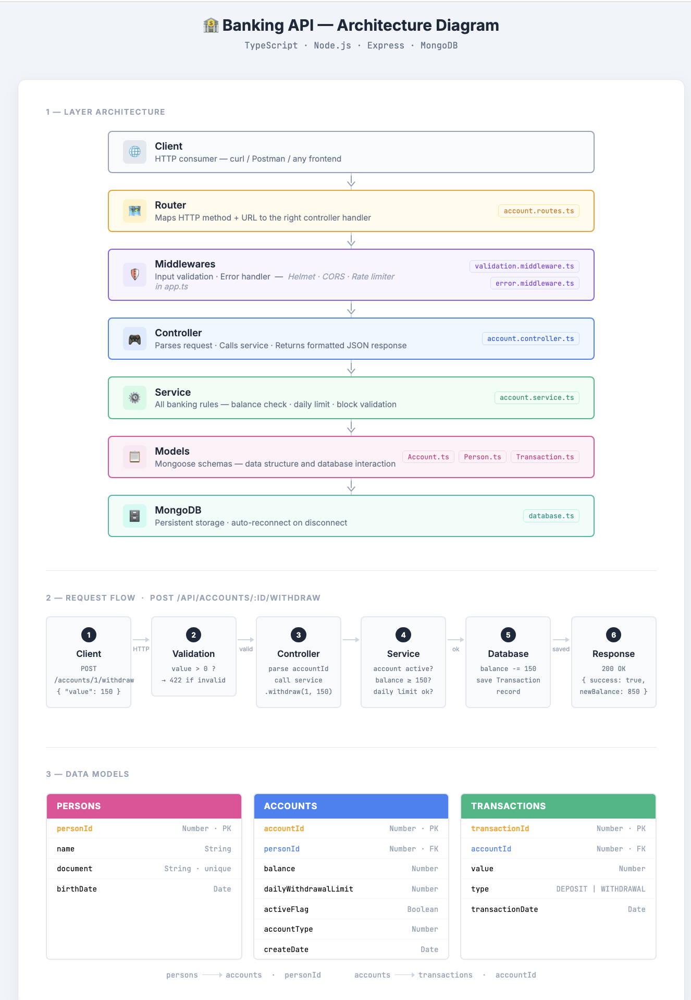

# 🏦 Banking Account Management API

REST API for banking account management built with **TypeScript**, **Node.js**, **Express** and **MongoDB**.

---

## 📐 Architecture

```
src/
├── config/
│   └── database.ts          # MongoDB connection + auto-reconnect
├── models/
│   ├── Person.ts            # Mongoose schema - Persons
│   ├── Account.ts           # Mongoose schema - Accounts
│   └── Transaction.ts       # Mongoose schema - Transactions
├── services/
│   └── account.service.ts   # All banking business logic
├── controllers/
│   └── account.controller.ts # HTTP request → service call → response
├── routes/
│   └── account.routes.ts    # Endpoint definitions
├── middlewares/
│   ├── validation.middleware.ts  # Input validation (express-validator)
│   └── error.middleware.ts       # Centralized error handling
├── utils/
│   ├── logger.ts            # Winston logger
│   ├── response.ts          # Standardized response helpers
│   └── seed.ts              # Database seed script
├── tests/
│   ├── account.service.test.ts   # Unit tests (business logic)
│   └── account.routes.test.ts    # Integration tests (HTTP endpoints)
├── app.ts                   # Express setup (middlewares, routes)
└── server.ts                # Entry point + graceful shutdown
```

## Architecture Diagram

A visual diagram of the layer architecture, request flow and data models is available here:


### Technical Choices

| Layer         | Choice                                   | Reason                               |
| ------------- | ---------------------------------------- | ------------------------------------ |
| Language      | TypeScript                               | Strict typing, better DX             |
| Framework     | Express                                  | Lightweight, mature ecosystem        |
| Database      | MongoDB + Mongoose                       | Flexible schema, natural modeling    |
| Validation    | express-validator                        | Declarative, chainable rules         |
| Logging       | Winston                                  | Structured logs, multiple transports |
| Security      | Helmet + CORS                            | Standard security headers            |
| Rate limiting | express-rate-limit                       | Protection against abuse             |
| Testing       | Jest + Supertest + mongodb-memory-server | Tests with no external dependency    |

---

## ⚙️ Prerequisites

- Node.js >= 18
- MongoDB >= 7.0
- npm >= 9

---

## 🚀 Getting Started

### 1. Clone the repository

```bash
git clone https://github.com/johnbendelac16/banking-api.git
cd banking-api
```

### 2. Install dependencies

```bash
npm install
```

### 3. Configure environment variables

```bash
cp .env.example .env
```

`.env.example` content:

```env
NODE_ENV=development
PORT=3000
MONGODB_URI=mongodb://localhost:27017/banking_db
LOG_LEVEL=info
```

### 4. Start MongoDB

```bash
# Create the data folder if needed (first time only)
mkdir -p ~/data/db

mongod --dbpath ~/data/db
```

### 5. Seed the database

Creates 2 persons and 2 test accounts:

```bash
npm run seed
```

### 6. Start the server

```bash
# Development (hot reload)
npm run dev

# Production
npm run build
npm start
```

Server runs on `http://localhost:3000`.

---

## 🧪 Testing

Tests use `mongodb-memory-server` — no external MongoDB required.

```bash
# Run all tests with coverage
npm test

# Watch mode
npm run test:watch
```

---

## 📡 API Reference

Base URL: `http://localhost:3000/api`

All responses follow this format:

```json
{
  "success": true,
  "message": "...",
  "data": { ... }
}
```

---

### Health Check

**GET** `/health`

```bash
curl http://localhost:3000/health
```

```json
{ "success": true, "message": "OK" }
```

---

### Create an Account

**POST** `/api/accounts`

| Field                  | Type   | Required | Description                                 |
| ---------------------- | ------ | -------- | ------------------------------------------- |
| `personId`             | number | ✅       | ID of an existing person                    |
| `dailyWithdrawalLimit` | number | ✅       | Daily withdrawal limit                      |
| `accountType`          | number | ✅       | `1` = Checking, `2` = Savings, `3` = Salary |
| `initialBalance`       | number | ❌       | Initial balance (default: 0)                |

```bash
curl -X POST http://localhost:3000/api/accounts \
  -H "Content-Type: application/json" \
  -d '{"personId": 1, "dailyWithdrawalLimit": 500, "accountType": 1, "initialBalance": 1000}'
```

```json
{
  "success": true,
  "message": "Account created successfully",
  "data": {
    "accountId": 1,
    "personId": 1,
    "balance": 1000,
    "dailyWithdrawalLimit": 500,
    "activeFlag": true,
    "accountType": 1,
    "createDate": "2024-01-01T00:00:00.000Z"
  }
}
```

---

### Get Balance

**GET** `/api/accounts/:accountId/balance`

```bash
curl http://localhost:3000/api/accounts/1/balance
```

```json
{
  "success": true,
  "message": "Balance retrieved",
  "data": { "accountId": 1, "balance": 1000 }
}
```

---

### Deposit

**POST** `/api/accounts/:accountId/deposit`

```bash
curl -X POST http://localhost:3000/api/accounts/1/deposit \
  -H "Content-Type: application/json" \
  -d '{"value": 200}'
```

```json
{
  "success": true,
  "message": "Deposit successful",
  "data": { "accountId": 1, "newBalance": 1200 }
}
```

---

### Withdraw

**POST** `/api/accounts/:accountId/withdraw`

```bash
curl -X POST http://localhost:3000/api/accounts/1/withdraw \
  -H "Content-Type: application/json" \
  -d '{"value": 150}'
```

```json
{
  "success": true,
  "message": "Withdrawal successful",
  "data": { "accountId": 1, "newBalance": 1050 }
}
```

**Error cases (400):**

- Insufficient funds → `"Insufficient funds"`
- Daily limit exceeded → `"Daily withdrawal limit exceeded..."`
- Account blocked → `"Account X is blocked"`

---

### Block an Account

**PATCH** `/api/accounts/:accountId/block`

```bash
curl -X PATCH http://localhost:3000/api/accounts/1/block
```

```json
{
  "success": true,
  "message": "Account blocked",
  "data": { "accountId": 1, "activeFlag": false }
}
```

---

### Account Statement

**GET** `/api/accounts/:accountId/statement`

| Query param | Type     | Description                    |
| ----------- | -------- | ------------------------------ |
| `startDate` | ISO 8601 | Filter from this date          |
| `endDate`   | ISO 8601 | Filter until this date         |
| `page`      | number   | Page number (default: 1)       |
| `limit`     | number   | Results per page (default: 20) |

```bash
# All transactions
curl http://localhost:3000/api/accounts/1/statement

# Filtered by period
curl "http://localhost:3000/api/accounts/1/statement?startDate=2024-01-01&endDate=2024-12-31&page=1&limit=10"
```

```json
{
  "success": true,
  "message": "Statement retrieved",
  "data": {
    "accountId": 1,
    "currentBalance": 1050,
    "activeFlag": true,
    "pagination": {
      "page": 1,
      "limit": 10,
      "total": 2,
      "totalPages": 1
    },
    "transactions": [
      {
        "transactionId": 2,
        "accountId": 1,
        "value": -150,
        "type": "WITHDRAWAL",
        "transactionDate": "2024-01-15T10:30:00.000Z"
      },
      {
        "transactionId": 1,
        "accountId": 1,
        "value": 200,
        "type": "DEPOSIT",
        "transactionDate": "2024-01-15T10:00:00.000Z"
      }
    ]
  }
}
```

---

## 🗄️ Data Models

### persons

| Field       | Type   | Description                        |
| ----------- | ------ | ---------------------------------- |
| `personId`  | Number | Unique auto-incremented identifier |
| `name`      | String | Full name                          |
| `document`  | String | Document number (unique)           |
| `birthDate` | Date   | Date of birth                      |

### accounts

| Field                  | Type    | Description                        |
| ---------------------- | ------- | ---------------------------------- |
| `accountId`            | Number  | Unique auto-incremented identifier |
| `personId`             | Number  | Reference to a person              |
| `balance`              | Number  | Current balance                    |
| `dailyWithdrawalLimit` | Number  | Daily withdrawal limit             |
| `activeFlag`           | Boolean | `true` = active, `false` = blocked |
| `accountType`          | Number  | 1=Checking, 2=Savings, 3=Salary    |
| `createDate`           | Date    | Account creation date              |

### transactions

| Field             | Type   | Description                                    |
| ----------------- | ------ | ---------------------------------------------- |
| `transactionId`   | Number | Unique auto-incremented identifier             |
| `accountId`       | Number | Reference to an account                        |
| `value`           | Number | Amount (positive=deposit, negative=withdrawal) |
| `type`            | String | `DEPOSIT` or `WITHDRAWAL`                      |
| `transactionDate` | Date   | Transaction date                               |

---

## 🛡️ Resilience & Failure Points

| Risk                         | Mitigation                          |
| ---------------------------- | ----------------------------------- |
| Invalid input                | express-validator with 422 response |
| Insufficient funds           | Balance check before update         |
| Daily limit exceeded         | Aggregation of today's withdrawals  |
| Operation on blocked account | Flag check before any operation     |
| API abuse / DDoS             | Rate limiting (100 req / 15 min)    |
| Unhandled exceptions         | Global error handler middleware     |
| MongoDB disconnection        | Auto-reconnect + logs               |
| Server crash                 | Graceful shutdown on SIGTERM/SIGINT |

---

## 📦 Available Scripts

| Script          | Description                            |
| --------------- | -------------------------------------- |
| `npm run dev`   | Start in development mode (hot reload) |
| `npm run build` | Compile TypeScript to JavaScript       |
| `npm start`     | Run the compiled build                 |
| `npm test`      | Run tests with coverage                |
| `npm run seed`  | Populate the database with test data   |

---

## 📝 Note on MongoDB Transactions

In standalone development mode, MongoDB sessions are not available (they require a Replica Set). Deposit and withdrawal operations work without sessions locally.

In production, it is recommended to run MongoDB with a Replica Set to benefit from atomic transactions:

```bash
mongod --dbpath ~/data/db --replSet rs0
# then once only:
mongosh --eval "rs.initiate()"
```

## 🔮 Possible Improvements

- JWT authentication to verify account ownership
- HTTPS support
- Docker setup for easier deployment
